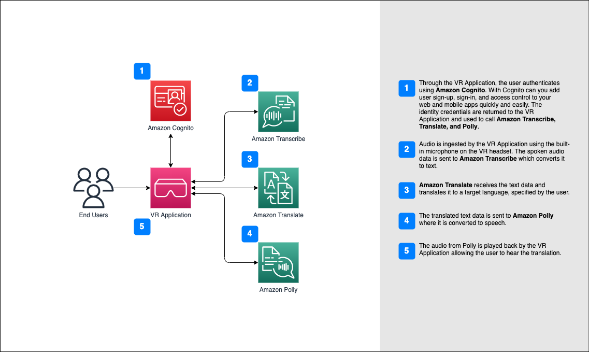

# Spatial-Real-Time-Transation

In this sample we show how Amazon Transcribe, Amazon Translate, and Amazon Polly can be used together to produce a near real-time speech-to-speech translator solution for your next VR project. This repository is structured with a backend/ folder that contains CDK files to deploy AWS backend services, and a unity/vr-real-time-translation folder that contains the Unity VR project build using Unity version 2021.3.19f1. 

## Usage
This Unity VR project is designed to be customizable and can be used as a foundation to build your own multi-user VR experiences. You can use this project as a starting point to build a wide range of VR applications, including games, simulations, and training programs.

To get started, you can use the Unity Editor to modify the VR environment and game mechanics to suit your specific needs. You can also add new features and functionality, such as multi-user support, using AWS services like Amazon API Gateway, Amazon S3, and Amazon DynamoDB.

The project was created as a starting point for building your own custom VR experience, and with the included AWS backend resources, you can easily add multi-user support and cloud-based functionality to your app. With a little creativity and some programming skills, you can expand on this project to create your own unique and engaging VR experience.

## Prerequisites

Before you begin, please make sure you have the following:

- Unity installed on your computer.
- AWS CLI installed and configured with valid credentials (for AWS CDK deployment).
- Node JS and NPM to install CDK dependency
- Basic knowledge of Unity and AWS.

## Architecture Diagram

## Installation
### Overview
To get started with the Unity VR project, please follow these steps:

1. Clone this repository to your local machine.
2. Navigate to the `backend/` folder in the repository and install CDK dependency by running `npm install`
3. Deploy the AWS backend services using the AWS CDK by running `cdk deploy`.
4. The deployment will output the following values which you will require later. `CognitoUserPoolId`, `CognitoClientId`, `IdentityPoolId`
5. Once the backend services are deployed, navigate to the `unity/vr-real-time-translation/Assets/Plugins` folder in the repository.
6. Download the following .NET DLL files and save to `Plugins` folder [Download .NET DLL](###Download-.NET-DLL)
    - Amazon.Extensions.CognitoAuthentication.dll
    - AWSSDK.CognitoIdentity.dll
    - AWSSDK.CognitoIdentityProvider.dll
    - AWSSDK.Core.dll
    - AWSSDK.Polly.dll
    - AWSSDK.SecurityToken
    - AWSSDK.Translate.dll
    - Microsoft.Bcl.AsyncInterfaces.dll
    - System.Runtime.CompilerServices.Unsafe.dll
    - System.Threading.Tasks.Extensions.dll
7. Open the Unity project in Unity version 2021.3.19f1. [Unity Instructions](###Unity-Installation)
8. In the Unity Editor, open the `Assets/ScriptableObjects/AWSConfig` and under Resources-> Cognito update the `User Pool ID`, `App Client ID`, and `Identity Pool ID` values with the output of the cdk deploy command.
9. In the Unity Editor, open the `Assets/Scenes` folder and select Main scene. 
10. Once the configuration is complete, you can run the Unity VR project.

### Unity Installation
To open the Unity project in Unity version 2021.3.19f1, please follow these steps:

1. Install and open Unity Hub on your computer.
2. Click on the "Projects" tab in the left-hand sidebar.
3. Click on the "Open" button and select the folder where you cloned the Unity VR project repository. `unity/vr-real-time-translation`
4. Once the project is added to Unity Hub, click on the project tile to open it.
5. In the project window, click on the Unity version dropdown menu and select "2021.3.19f1".
6. Unity will automatically download and install the selected version of Unity.
7. Once the installation is complete, the Unity VR project will open in the Unity Editor.
8. After completing the above steps, you can continue with the instructions in the Readme file to configure the AWS backend services and update the AWS Config game object in the Unity project.

### Download .NET DLL
When using the AWS SDK for .NET and .NET Standard 2.0 for your Unity application, your application must reference the AWS SDK for .NET assemblies (DLL files) directly rather than using NuGet.
For more information see 
- [Special considerations for Unity support](https://docs.aws.amazon.com/sdk-for-net/v3/developer-guide/unity-special.html)
- [Obtaining assemblies for the AWS SDK for .NET](https://docs.aws.amazon.com/sdk-for-net/v3/developer-guide/net-dg-obtain-assemblies.html#download-zip-files)

You can opt to obtain the .dll from nuget.org by downloading the corresponding package. After successful download, rename the file extension from .nupkg to .zip, extract the DLL from the designated path located in lib/netstandard2.0.

### Using the app
To use the app, you will need to create an account. This account will be created in the User Pool that is deployed via CDK. Cognito User Pool is a fully managed service provided by AWS that enables you to easily add user sign-up, sign-in, and access control to your web and mobile apps. Cognito User Pool acts as a user directory that can scale to hundreds of millions of users, so you don't have to worry about building and maintaining your own authentication system.

1. In the Sign Up menu and fill in your full name, email address, username, and password.
2. Keep in mind your email address will need to be verified before you can proceed.
3. The password will need to meet certain complexity requirements, including a minimum length of 12 characters, at least one lowercase letter, one uppercase letter, one digit, and one symbol.
4. Once you have filled in all the required information and completed the Sign Up process, you will receive an email verification with a link to confirm your account. 
5. After you have confirmed your account, return back to the application and continue with Sign In process. 
6. After a successful sign in - you will be presented with a drop down menu with three categories. Source Languages, Target Languages and Voice. Select your desired input values and click Start Translation.
7. Speak into your microphone to start streaming your voice. You will see a translated text on the screen and audio playback via your speaker of the translated text. 
8. When you are done, press the Stop Translation button to close websocket connection. 

## Contribution
We welcome contributions from the community to help improve and enhance this open-source Unity VR project. If you would like to contribute, please follow these guidelines:

Fork the repository and make your changes in a new branch.
Submit a pull request with a detailed description of your changes.
Your changes will be reviewed, and if approved, will be merged into the main branch.

## License
This sample code is made available under the MIT-0 license. See the LICENSE file.
